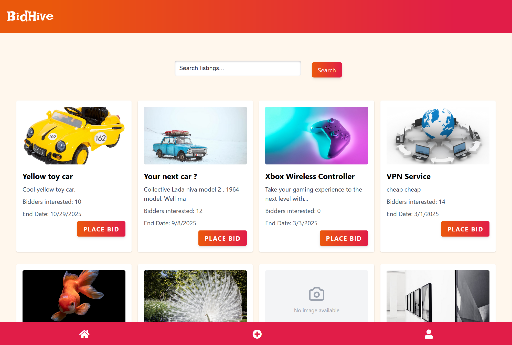

# Auction Website



An online auction platform where users can create listings and bid on items. Built with Vite and Tailwind CSS.

## 🌐 Live Demo

Check out the live demo: [Auction Website](https://bidhive.netlify.app/)

## ✨ Features

-   User registration and authentication (for @stud.noroff.no email addresses)
-   Create and manage auction listings
-   Place bids on active auctions
-   Search functionality for listings
-   User profile management with avatar updates
-   Credit system for bidding and selling

## 🛠️ Built With

-   Vite
-   Tailwind CSS
-   ESLint and Prettier for code quality
-   Husky for git hooks
-   PostCSS for CSS processing

## 🚀 Getting Started

### Prerequisites

-   Node.js (version 14 or higher)
-   npm (comes with Node.js)
-   Git

### Installation

1. Clone the repository
    ```bash
    git clone https://github.com/BergitTveit/Semester-Project-2
    cd Semester-Project-2
    ```
2. Install dependencies
    ```bash
    npm install
    ```
3. Start the development server
    ```bash
    npm run dev
    ```

### Available Scripts

-   `npm run dev` - Start development server
-   `npm run build` - Build for production
-   `npm run preview` - Preview production build
-   `npm run watch` - Watch for CSS changes
-   `npm run lint` - Lint JavaScript files

## 🔌 API Integration

This project interfaces with the Noroff API. All endpoints are documented in the [API Swagger documentation](https://api.noroff.dev/docs).

## 🔍 Code Quality

This project uses:

-   ESLint for JavaScript linting
-   Prettier for code formatting
-   Husky for pre-commit hooks
-   lint-staged for running checks on staged files

## 🚢 Deployment

The application is configured for deployment on Netlify or GitHub Pages. The build command is:

```bash
npm run build
```

## 🤝 Contributing

1. Fork the repository
2. Create your feature branch (`git checkout -b feature/AmazingFeature`)
3. Commit your changes (`git commit -m 'Add some AmazingFeature'`)
4. Push to the branch (`git push origin feature/AmazingFeature`)
5. Open a Pull Request

## 📞 Contact

Email: bergittveit@gmail.com

Project Link: https://github.com/BergitTveit/Semester-Project-2

## 📜 License

This project is licensed under the MIT License - see the LICENSE.md file for details

## 👏 Acknowledgments

-   Noroff School of Technology for the API
